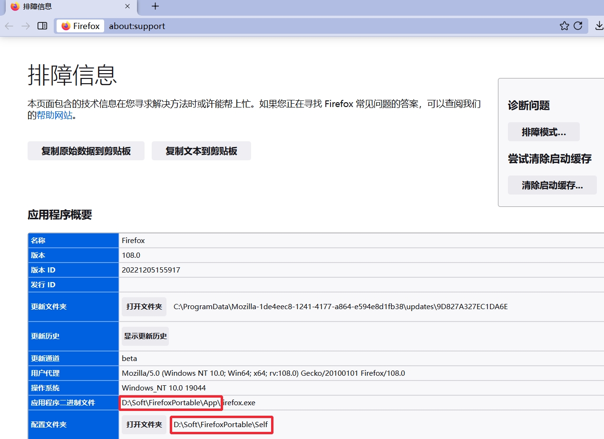
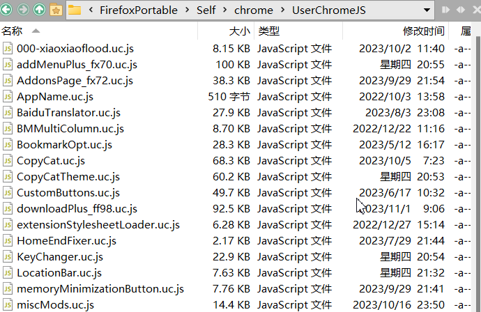

# userChrome.js 环境

一个功能丰富的 Firefox 用户界面自定义脚本加载器。基于 alice0775 环境，集成了 Bootstrap Loader（支持安装传统扩展）和反签名校验，提供 Greasemonkey 风格的元数据声明、四种执行模式（chrome 脚本、后台模块、自定义 Actor、内容脚本）、ESM 模块支持、偏好设置 API、函数 Hook 工具等基础设施。同时提供 `UC`/`_uc`/`xPref` 等跨环境兼容对象，可无需移植直接运行 alice0775、xiaoxiaoflood、mrOtherGuy 等环境的脚本。

~~之前是从 Firefox 100开始改的，实际上可以向下兼容，具体版本没有测试。~~

从 20250219 以后的版本建议兼容性为 Firefox 135+

## 下载

| 版本    | 说明                | 地址                                                                        |
| ------- | ------------------- | --------------------------------------------------------------------------- |
| Nightly | 最新开发版（推荐）  | [下载](https://github.com/benzBrake/userChrome.js-Loader/releases/tag/nightly) |
| Fx100+  | Firefox 100+ 最终版 | [下载](https://github.com/benzBrake/userChrome.js-Loader/releases/tag/fx_100)  |

## 使用说明

解压后最多有两个目录，`program`目录里的东西要解压到 Firefox.exe 所在目录，`profile`目录里的文件要解压到配置文件夹。

#### 如何查找 Firefox.exe 所在目录 和 配置文件夹？看图

注意：Linux 下软件目录可能需要**管理员权限**才能访问、

#### 安装 userChrome.js 环境后如何安装脚本？

下载 `.uc.js` 后缀的文件保存到**配置文件夹**下的**chrome**文件夹下

## 兼容的脚本

| 序号 | 地址                                                                   | 程度 |
| ---- | ---------------------------------------------------------------------- | ---- |
| 1    | https://github.com/alice0775/userChrome.js                             | 100% |
| 2    | https://github.com/benzBrake/FirefoxCustomize/tree/master/userChromeJS | 90%  |
| 3    | https://github.com/Endor8/userChrome.js                                | 大量 |
| 4    | https://github.com/xiaoxiaoflood/firefox-scripts/                      | 少量 |
| 5    | https://github.com/aminomancer/uc.css.js/tree/master/JS                | 少量 |
| 6    | https://github.com/Aris-t2/CustomJSforFx                               | 少量 |

## 兼容的传统扩展

https://github.com/xiaoxiaoflood/firefox-scripts/tree/master/extensions
