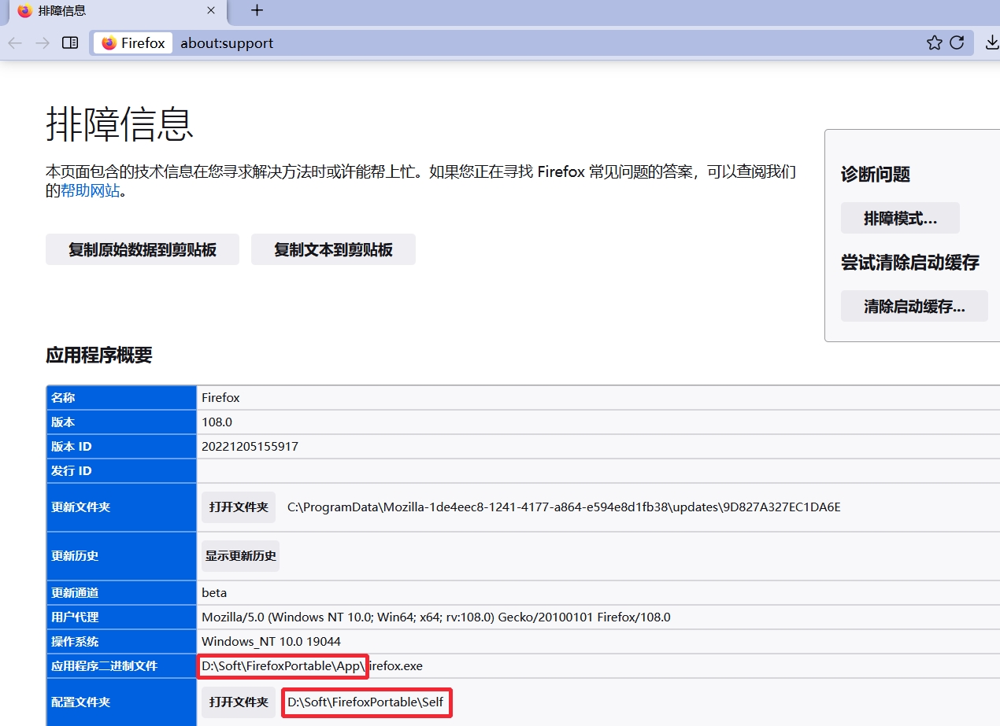
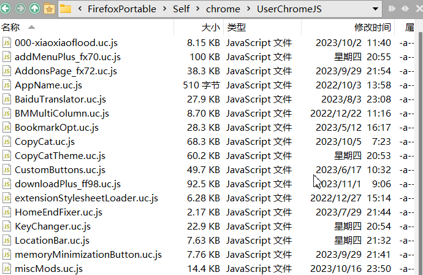

# userChrome.js Environment | userChrome.js 环境

**[中文](#中文)** · **[English](#english)**

---

## 中文

一个功能丰富的 Firefox 用户界面自定义脚本加载器。基于 alice0775 环境，集成了 Bootstrap Loader（支持安装传统扩展）和反签名校验，提供 Greasemonkey 风格的元数据声明、四种执行模式（chrome 脚本、后台模块、自定义 Actor、内容脚本）、ESM 模块支持、偏好设置 API、函数 Hook 工具等基础设施。同时提供 `UC`/`_uc`/`xPref` 等跨环境兼容对象，可无需移植直接运行 alice0775、xiaoxiaoflood、mrOtherGuy 等环境的脚本。

~~之前是从 Firefox 100开始改的，实际上可以向下兼容，具体版本没有测试。~~

从 20250219 以后的版本建议兼容性为 Firefox 135+

### 下载

| 版本        | 说明                       | 地址                                                                        |
| ----------- | -------------------------- | --------------------------------------------------------------------------- |
| Stable 3.1.1 | 首个 SemVer 稳定版 | [下载](https://github.com/benzBrake/userChrome.js-Loader/releases/tag/v3.1.1) |
| Nightly      | 最新开发版（测试用）          | [下载](https://github.com/benzBrake/userChrome.js-Loader/releases/tag/nightly) |

`fx_100` 和 `fx_136-155` 是旧的兼容范围命名，仅保留用于历史链接，不再作为当前版本入口。

### 使用说明

压缩包包含 `program`、`profile` 和供编辑器使用的 `types` 目录。安装时只需把 `program` 目录里的内容解压到 Firefox.exe 所在目录，并把 `profile` 目录里的文件解压到配置文件夹；`types` 不需要复制到 Firefox。

#### 如何查找 Firefox.exe 所在目录和配置文件夹？看图



注意：Linux 下软件目录可能需要**管理员权限**才能访问。

#### 安装 userChrome.js 环境后如何安装脚本？

下载 `.uc.js` 后缀的文件保存到**配置文件夹**下的**chrome** 文件夹下。



### 开发文档

| 文档 | 说明 |
| ---- | ---- |
| [GUIDE.md](./GUIDE.md) | 脚本编写指南（中文） |
| [GUIDE-en_US.md](./GUIDE-en_US.md) | Script Authoring Guide (English) |

### 参与开发

仓库源码位于 `src/`，开发环境使用 Node.js 24 和 npm。

```bash
npm install
npm run check
```

`npm install` 会安装提交前 lint hook。`npm run check` 会依次执行 lint、测试和构建，并将可发布目录生成到 `dist/userChrome.js-Loader/`。

#### 兼容性测试

`Compatibility test` workflow 会在 GitHub Actions 上安装真实 Firefox、部署 loader 并运行金丝雀脚本做端到端验证。对 `main` 发起的 PR 自动测试声明范围下限、上限和当前 stable 版本；也可在 Actions 页面手动触发，并用 `firefox-version` 输入指定任意版本（如 `157.0`、`latest-nightly`），便于新版本兼容测试。

本地可对独立安装的 Firefox 运行同一测试入口（勿指向日常使用的实例）：

```bash
npm run test:compat -- --firefox <path-to-firefox>
```

### 兼容的脚本

| 序号 | 地址                                                                   | 程度 |
| ---- | ---------------------------------------------------------------------- | ---- |
| 1    | https://github.com/alice0775/userChrome.js                             | 100% |
| 2    | https://github.com/benzBrake/FirefoxCustomize/tree/master/userChromeJS | 90%  |
| 3    | https://github.com/Endor8/userChrome.js                                | 大量 |
| 4    | https://github.com/xiaoxiaoflood/firefox-scripts/                      | 少量 |
| 5    | https://github.com/aminomancer/uc.css.js/tree/master/JS                | 少量 |
| 6    | https://github.com/Aris-t2/CustomJSforFx                               | 少量 |

### 兼容的传统扩展

https://github.com/xiaoxiaoflood/firefox-scripts/tree/master/extensions

#### 传统扩展选项窗口

对于使用 `<em:optionsType>1</em:optionsType>` 的独立选项窗口，可以在 `install.rdf` 中声明是否允许缩放以及默认内容尺寸：

```xml
<em:optionsResizable>true</em:optionsResizable>
<em:optionsWidth>1080</em:optionsWidth>
<em:optionsHeight>720</em:optionsHeight>
```

Loader 会为该扩展的选项窗口添加 `resizable`、`width` 和 `height` 特性。省略 `optionsResizable` 或设为 `false` 时，窗口保持不可缩放；省略某个尺寸属性时，Firefox 自动确定对应尺寸。`optionsWidth` 和 `optionsHeight` 必须是 100 到 10000 之间的整数 CSS 像素值。

---

## English

A feature-rich Firefox UI customization script loader. Based on the alice0775 environment, it integrates a Bootstrap Loader (supports installing legacy extensions) and signature verification bypass. It provides Greasemonkey-style metadata declarations, four execution modes (chrome scripts, background modules, custom Actors, content scripts), ESM module support, preferences API, function hook utilities, and more. It also offers cross-environment compatible objects such as `UC`/`_uc`/`xPref`, enabling scripts from alice0775, xiaoxiaoflood, mrOtherGuy, and other environments to run without porting.

~~Previously modified from Firefox 100; actually backward compatible, but exact versions untested.~~

Versions after 20250219 are recommended for Firefox 135+.

### Downloads

| Version    | Description                            | Link                                                                        |
| ---------- | -------------------------------------- | --------------------------------------------------------------------------- |
| Stable 3.1.1 | First SemVer stable release | [Download](https://github.com/benzBrake/userChrome.js-Loader/releases/tag/v3.1.1) |
| Nightly      | Latest development build (testing only) | [Download](https://github.com/benzBrake/userChrome.js-Loader/releases/tag/nightly) |

`fx_100` and `fx_136-155` are legacy compatibility names retained only for historical links; they are no longer current release entry points.

### Installation

The archive contains `program`, `profile`, and editor declarations in `types`. For installation, extract the contents of `program` into the directory containing Firefox.exe and copy the files in `profile` into the profile folder. The `types` directory does not need to be copied into Firefox.

#### How to find the Firefox.exe directory and profile folder? See the screenshot


Note: On Linux, the application directory may require **administrator privileges** to access.

#### How to install scripts after setting up the userChrome.js environment?

Download files with the `.uc.js` extension and save them to the **chrome** folder inside the **profile folder**.


### Documentation

| Document | Description |
| -------- | ----------- |
| [GUIDE.md](./GUIDE.md) | 脚本编写指南（中文） |
| [GUIDE-en_US.md](./GUIDE-en_US.md) | Script Authoring Guide (English) |

### Development

Source files live in `src/`. Development uses Node.js 24 and npm.

```bash
npm install
npm run check
```

`npm install` installs the pre-commit lint hook. `npm run check` runs lint, tests, and the build, producing the distributable directory at `dist/userChrome.js-Loader/`.

#### Compatibility testing

The `Compatibility test` workflow installs a real Firefox on GitHub Actions, deploys the loader, and runs a canary script for end-to-end verification. Pull requests against `main` automatically test the declared minimum, declared maximum, and current stable versions. You can also trigger it manually from the Actions tab and pass any version via the `firefox-version` input (e.g. `157.0`, `latest-nightly`), which is handy for testing upcoming Firefox releases.

The same entry point can be run locally against a standalone Firefox installation (never point it at your daily-use instance):

```bash
npm run test:compat -- --firefox <path-to-firefox>
```

### Compatible Scripts

| # | URL                                                                      | Compatibility |
| - | ------------------------------------------------------------------------ | ------------- |
| 1 | https://github.com/alice0775/userChrome.js                               | 100%          |
| 2 | https://github.com/benzBrake/FirefoxCustomize/tree/master/userChromeJS   | 90%           |
| 3 | https://github.com/Endor8/userChrome.js                                  | Extensive     |
| 4 | https://github.com/xiaoxiaoflood/firefox-scripts/                        | Limited       |
| 5 | https://github.com/aminomancer/uc.css.js/tree/master/JS                  | Limited       |
| 6 | https://github.com/Aris-t2/CustomJSforFx                                 | Limited       |

### Compatible Legacy Extensions

https://github.com/xiaoxiaoflood/firefox-scripts/tree/master/extensions

#### Legacy Extension Options Dialogs

For standalone options windows using `<em:optionsType>1</em:optionsType>`, declare whether the dialog is resizable and its default content size in `install.rdf`:

```xml
<em:optionsResizable>true</em:optionsResizable>
<em:optionsWidth>1080</em:optionsWidth>
<em:optionsHeight>720</em:optionsHeight>
```

The Loader adds the `resizable`, `width`, and `height` window features for that extension. If `optionsResizable` is omitted or set to `false`, the options window remains non-resizable. If either size property is omitted, Firefox determines that dimension automatically. `optionsWidth` and `optionsHeight` must be integer CSS-pixel values from 100 through 10000.
